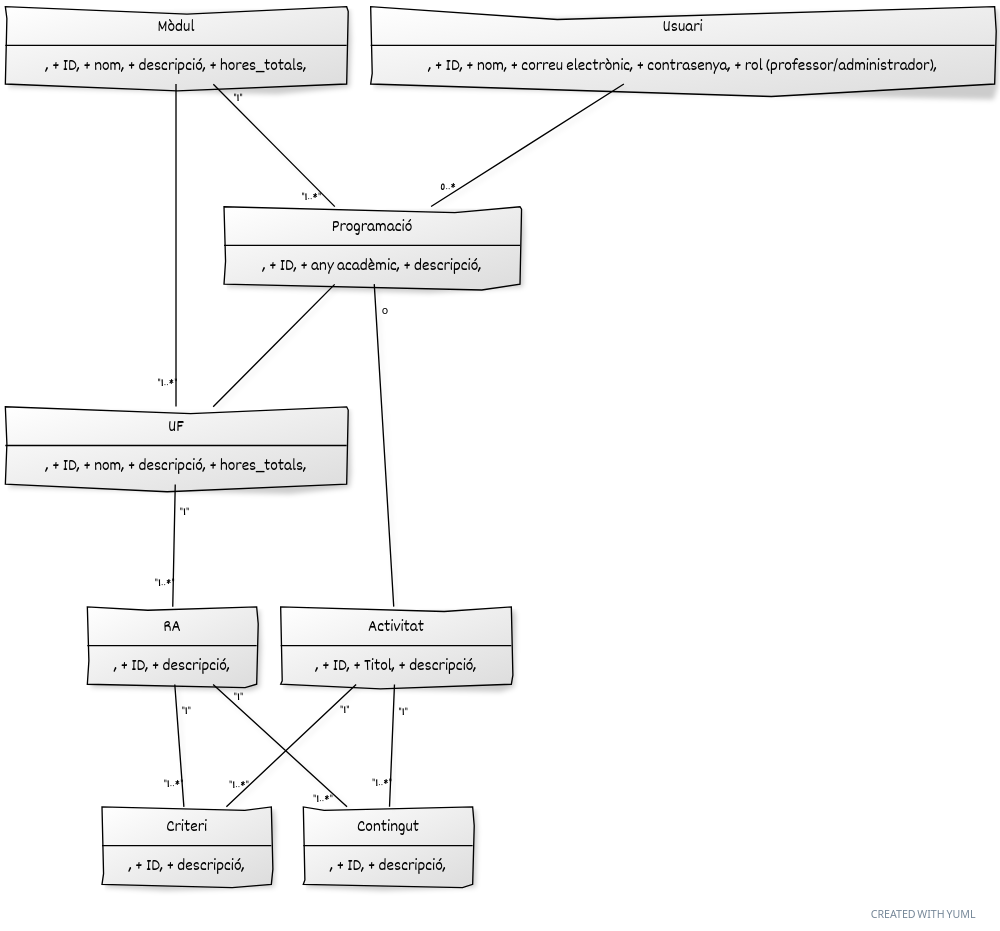

# Sistema de Gestión de Programaciones Didácticas

Este proyecto es una aplicación web desarrollada en Laravel para la gestión de programaciones didácticas en el ámbito educativo. Proporciona herramientas para que los profesores puedan organizar y administrar sus unidades formativas, resultados de aprendizaje, criterios de evaluación y contenidos.

## Requisitos Previos

Asegúrate de tener instalado lo siguiente antes de ejecutar la aplicación:

- [Composer](https://getcomposer.org/)
- [PHP](https://www.php.net/)
- [Node.js](https://nodejs.org/)
- [MySQL](https://www.mysql.com/)

## Instalación

1. Clona el repositorio:

   ```bash
   git clone https://github.com/tu-usuario/tu-proyecto.git

   Instala las dependencias de Composer:
   composer install
   
Copia el archivo de configuración .env y configura la conexión a la base de datos:
cp .env.example .env

Genera la clave de la aplicación:
php artisan key:generate

Ejecuta las migraciones y los seeders para crear la base de datos y llenarla con datos de ejemplo:
php artisan migrate --seed

Inicia el servidor de desarrollo:
php artisan serve

Visita http://localhost:8000 en tu navegador para acceder a la aplicación.

Funcionalidades Principales
- Sistema de Login: Los profesores y administradores pueden iniciar sesión en la aplicación.
- Gestión de Programaciones Didácticas: Capacidad para crear, modificar y eliminar programaciones.
- Gestión de Unidades Formativas (UF): Administración de las UF, incluyendo la creación, modificación y eliminación.
- Gestión de Resultados de Aprendizaje (RA): Herramientas para gestionar los RA dentro de cada UF, incluyendo la adición, modificación y eliminación de criterios de evaluación y contenidos asociados.
- Roles de Usuario: Diferenciación entre roles de usuario: profesor y administrador.
- Vista de Administrador: Capacidad del administrador para ver, crear, modificar y eliminar todas las programaciones y sus componentes.
- Creación de Módulo por el Administrador con RA, Criterios y Contenidos.
- Creación de Programación del Módulo por el Profesor con la adición de actividades.
- Validación de horas en las UF: Se valida que todas las actividades de cada UF sumen el número de horas correcto.

## Diagrama de Clases


## Contribuciones
Si encuentras errores o mejoras posibles, no dudes en contribuir abriendo un issue o enviando un pull request.

Licencia
Este proyecto está bajo la Licencia MIT. Consulta el archivo LICENSE para obtener más detalles.


Este README es un punto de partida; puedes personalizarlo según las necesidades específicas de tu proyecto. Además, asegúrate de mantenerlo actualizado a medida que el proyecto evoluciona.
